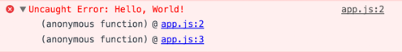

# babel-plugin-transform-export-default-name

[](https://www.npmjs.org/package/babel-plugin-transform-export-default-name)
[](https://travis-ci.org/gajus/babel-plugin-transform-export-default-name)
[](https://github.com/gajus/canonical)

Babel plugin that transforms `export default` of anonymous functions to named function export.

Plugin uses the name of the target file to create a temporary variable. Target resource (arrow function or an anonymous function) is assigned to the latter temporary variable. Temporary value is used in place of function in the export declaration.

## Problem

Executing a function without a name (arrow function or an anonymous function) appears as an `(anonymous function)` in the stack trace, e.g.

```js
(() => {
    throw new Error('Hello, World!');
})();
```



However, if an arrow function is defined on the right-hand-side of an assignment expression, the engine will take the name on the left-hand-side and use it to set the arrow function's `.name`, e.g.

```js
let test;

test = () => {
    throw new Error('Hello, World!');
};

test();
```


When you export an anonymous function using `export default`, this function will appear as an `(anonymous function)` the stack trace. `babel-plugin-transform-export-default-name` plugin transforms the code to assign function a name before it is exported.

## Example

Input file is `./foo.js`.

Input code:

```js
export default () => {};
```

Output code:

```js
let foo = () => {};

export default foo;
```

## Usage

Add to `.babelrc`:

```js
{
    "plugins": [
        "transform-export-default-name"
    ]
}
```
